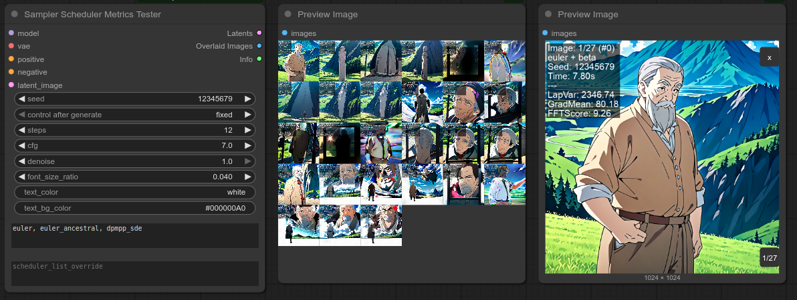
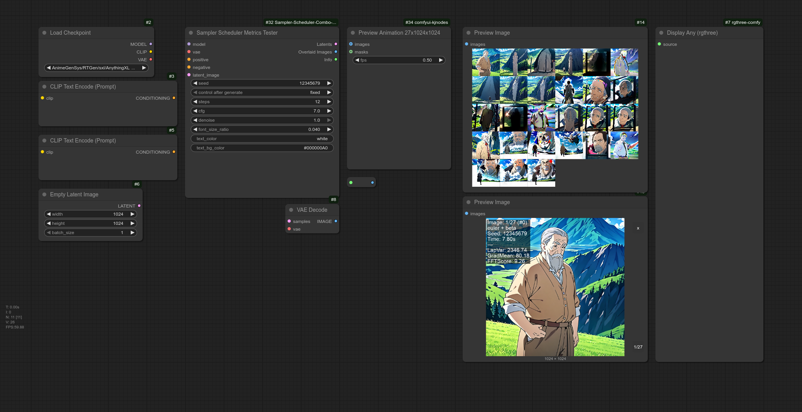
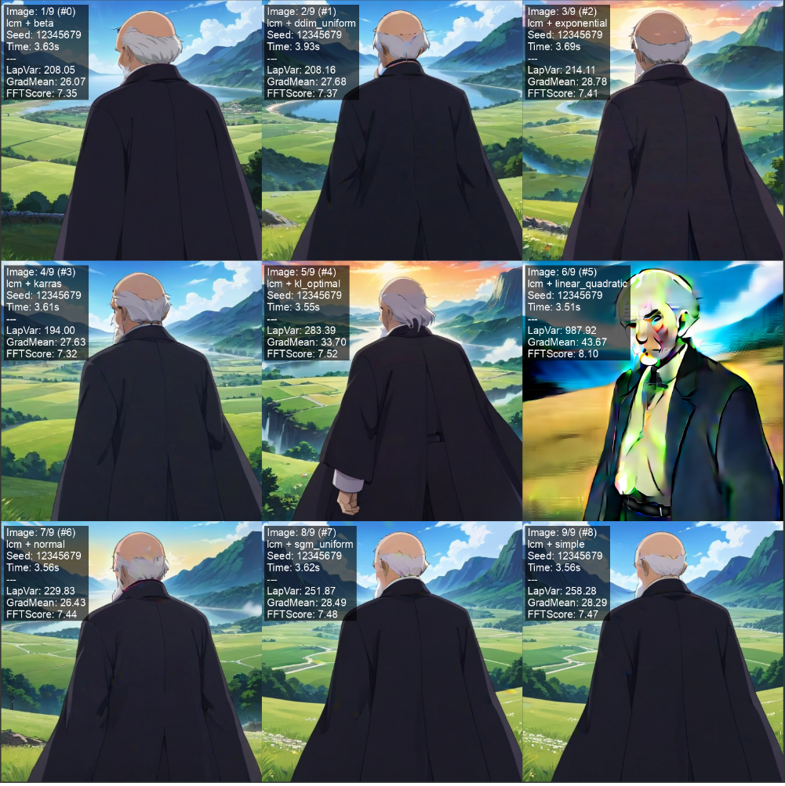
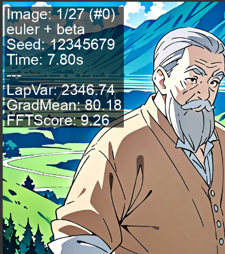

# Sampler Scheduler Metrics Tester for ComfyUI

This custom node for ComfyUI allows you to test combinations of samplers and schedulers. It generates a batch of generated images(latents), as well as RGB images, each one annotated with the specific combination used, performance timing, and several image quality metrics (Laplacian Variance, Gradient Mean, FFT-based sharpness) for our internal usage, but kept as they could may be useful for others to.
¿Have you ever wanted to have an easy way to render all combinations of samplers and schedulers with zero manual work? Then this custom node could help you. 


## Features

* Iterate trough all samples and schedulers
* Iterate through specified lists of samplers and schedulers.
* Overlay generated images with:
    * **Image Number:** `Image: X/Y (#Z)` format (1-based count / total, and 0-based index).
    * Sampler and Scheduler names.
    * Seed used for the test.
    * Generation time.
    * Several image quality metrics:
        * Laplacian Variance (sharpness).
        * Gradient Mean (detail/edges).
        * FFT-based Sharpness Score.
    * Status (OK/ERROR) and error messages if issues occur.
* Customizable font size, text color, and text background for overlays.
* Outputs a batch of generated latents, a batch of annotated images, and a text summary of all tests.

## Installation

1.  Clone this repository or download the folder containing these files (e.g., `sampler_scheduler_metrics_tester_project`) into your `ComfyUI/custom_nodes/` directory.
    ```bash
    cd ComfyUI/custom_nodes/
    git clone https://github.com/IcelandicCenterArtificialIntelligence/ComfyUI-SamplerSchedulerMetricsTester.git
    ```    
2.  **Dependencies:** This node uses `opencv-python` (cv2) for image metrics. If you don't have it installed in your ComfyUI's Python environment, you'll need to install it:
    ```bash
    pip install opencv-python
    ```
3.  Restart ComfyUI.

## How to Use

1.  In ComfyUI, add the "Sampler Scheduler Metrics Tester" node (found under the "sampling/testing" category).
2.  Connect the required inputs:
    * `model`: The diffusion model.
    * `vae`: The VAE model.
    * `positive`: Positive conditioning.
    * `negative`: Negative conditioning.
    * `latent_image`: An initial latent image (e.g., from an "Empty Latent Image" node).
3.  Adjust parameters:
    * `seed`, `steps`, `cfg`, `denoise`: Standard sampling parameters. The main `seed` is used to initialize the noise pattern for the entire batch of tests.
    * `sampler_list_override`: (Optional) Enter a comma or newline-separated list of samplers to test (e.g., `euler, dpm_2, dpm_adaptive`). Leave empty to use all available samplers. Names are case-insensitive but will use the official casing.
    * `scheduler_list_override`: (Optional) Enter a comma or newline-separated list of schedulers (e.g., `normal, karras, simple`). Leave empty for all available.
    * `font_size_ratio`, `text_color`, `text_bg_color`: Customize overlay text appearance.
4.  The node will iterate through all valid combinations, generating an image for each one.

## Example Workflow

Below is an example of how the "Sampler Scheduler Metrics Tester" node can be used in a workflow.

**1. Load the Example Workflow:**

You can easily load the example workflow into ComfyUI using one of the following methods:

* **Drag & Drop Workflow PNG:**
    Click the image below to download `workflow.png`. This PNG image has the entire ComfyUI workflow embedded within it. Simply download the `workflow.png` file and then drag and drop it directly onto your ComfyUI canvas to load the workflow.

    [](workflows/workflow.png)    

* **Load Workflow JSON:**
    Alternatively, you can download the workflow as a standard JSON file:
    [Download example_workflow.json](workflows/workflow.json)   
    Once downloaded, click the "Load" button in your ComfyUI interface and select this `.json` file.

## Inputs
**standard KSampler parameters**
* **model**: The main diffusion model.
* **vae**: The VAE for decoding latents.
* **seed**: Initial seed. This seed is used to generate a base noise pattern that is then used for each combination.
* **steps**: Number of sampling steps.
* **cfg**: Classifier Free Guidance scale.
* **positive**: Positive conditioning.
* **negative**: Negative conditioning.
* **latent_image**: The starting latent tensor.
* **denoise**: Denoising strength.
    
**Overlay parameters**
* **font_size_ratio (optional)**: Float, ratio of image height for font size.
* **text_color (optional)**: String, hex or named color for text.
* **text_bg_color (optional)**: String, hex color for text background (e.g., `#000000A0`).
    
**Sampler and Scheduler lists**
* **sampler_list_override (optional)**: String (multiline), specific samplers to test. If empty, it will iterate over all samplers. Delimiters are commas and new lines.
* **scheduler_list_override (optional)**: String (multiline), specific schedulers to test. If empty, it will iterate over all Schedulers. Delimiters are commas and new lines.

## Outputs

* **Latents**: Batch of all generated latent samples. 
* **Overlaid Images**: Batch of all generated images with text overlays detailing parameters and metrics.
  

* **Info**: A single string containing a line-by-line summary for each test performed, including status, combo, time, and metrics. 

## Image Metrics Explained

* **Laplacian Variance (LapVar):** Measures the "edginess" or sharpness. Higher values generally indicate a sharper image.
* **Gradient Mean (GradMean):** Reflects the average strength of intensity changes (edges). Higher values can indicate more detail.
* **FFT Sharpness Score (FFTScore):** Analyzes the image in the frequency domain. Higher frequency content often corresponds to sharper details.

These metrics are for our internal usage, but perhaps they could be of help for someone else.



## AI Generation Notice

In accordance with the spirit and guidelines from regulations like the European Union's AI Act, it is noted that a significant portion of the source code for this ComfyUI custom node was developed with the assistance of Artificial Intelligence tools. This collaboration involved AI in tasks ranging from initial code generation to refinement and debugging.

## License

Copyright (c) 2025 ICAI Icelandic Center for Artificial Intelligence ehf.

This project is licensed under the European Union Public Licence v.1.2 (EUPL-1.2). The full text of the license can be found in the [LICENSE](LICENSE) file in this repository and is also available at [https://joinup.ec.europa.eu/collection/eupl/eupl-text-eupl-12](https://joinup.ec.europa.eu/collection/eupl/eupl-text-eupl-12).

